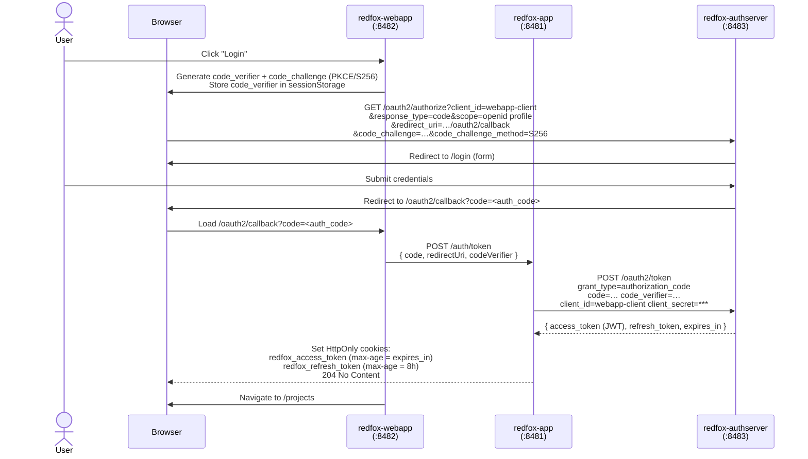
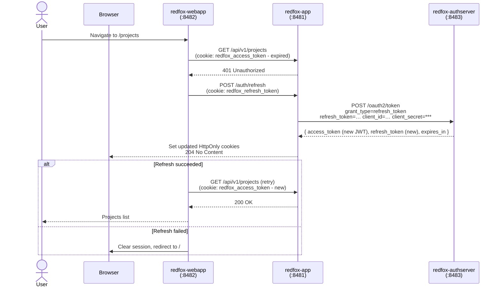

# RedFox Project

[](https://github.com/malczuuu/redfox-project/actions/workflows/gradle-build.yml)

> **Proof of Concept** - demonstrates OAuth2 PKCE authentication across a three-tier Spring Boot + Angular architecture.

> Note: This project uses [`checkmate`](https://github.com/malczuuu/checkmate) library. Read its `README.md` for setup
> as it's not published to Maven Central.

## Applications

| Application           | Port | Description                                                                                                                                                                                                                                                                                     |
|-----------------------|------|-------------------------------------------------------------------------------------------------------------------------------------------------------------------------------------------------------------------------------------------------------------------------------------------------|
| **redfox-app**        | 8481 | Spring Boot resource server. Exposes the REST API and acts as a backend-for-frontend (BFF) for token operations - it holds the client secret and proxies token exchange and refresh requests to the authserver, keeping credentials off the browser. Validates JWTs on every protected request. |
| **redfox-webapp**     | 8482 | Angular SPA. Entry point for the user. Initiates the OAuth2 PKCE flow, handles the authorization callback, and calls the resource API. Manages Projects, Things, and Users.                                                                                                                     |
| **redfox-authserver** | 8483 | Spring Authorization Server (OAuth2/OIDC). Authenticates users via a login form, issues short-lived access tokens (2 min) and long-lived refresh tokens (30 days). Sessions and authorizations are persisted in PostgreSQL.                                                                     |

## Authentication Flow

The webapp uses the OAuth2 Authorization Code flow with PKCE. The browser never sees the `client_secret` - all token 
requests are proxied through `redfox-app`.



## Token Refresh Flow

Access tokens expire after 2 minutes. The Angular `authInterceptor` transparently refreshes them on a 401 response and
retries the failed request. The refresh token is rotated on every use (`reuse-refresh-tokens: false`).



## XSRF Protection on Auth Endpoints

The `/auth/refresh` endpoint is protected against Cross-Site Request Forgery using the **double-submit cookie** pattern:

1. After a successful `/auth/token` (or `/auth/refresh`), the server sets a non-HttpOnly cookie `redfox_xsrf_token`
   containing a random UUID alongside the HttpOnly `redfox_refresh_token` cookie.
2. On every `/auth/refresh` call, the Angular `authInterceptor` reads `redfox_xsrf_token` from `document.cookie` and
   sends it as the `X-Xsrf-Token` request header.
3. `redfox-app` rejects the request with `400 Bad Request` if the header is absent or does not match the cookie value.
4. Both the refresh token and the XSRF token are **rotated** on every successful refresh. On logout, both cookies are
   cleared.

Angular's built-in `withXsrfConfiguration` is **not** used here - only `/auth/refresh` needs this protection (it is the
only endpoint that relies on a cookie for authentication). Regular API calls use an `Authorization: Bearer` header and
are therefore not vulnerable to CSRF.

## Dev & Test Configuration

<details>
<summary><b>Expand...</b></summary>

### Basic Auth

HTTP Basic authentication is enabled in `redfox-app` for testing convenience - it allows direct API calls without
running through the full OAuth2 flow. Configured via `redfox.auth.basic.enabled=true|false`.

### Keystore Configuration

Service `redfox-authserver` signs JWTs with an RSA key loaded from a PKCS12 keystore. The location is configured via
`redfox.security.key-store.location`, which accepts any Spring resource path.

**Generating a keystore:**

```bash
keytool -genkeypair -alias redfox-key -keyalg RSA -keysize 2048 \
  -storetype PKCS12 -keystore keystore.p12 \
  -storepass <password> -dname "CN=redfox-authserver" -validity 3650
```

**Classpath (default, bundled inside the jar):**

```yaml
redfox:
  security:
    key-store:
      location: classpath:keystore-dev.p12
      password: redfox-dev
      alias: redfox-key
```

**Mounted Docker volume:**

Place the keystore file at e.g. `/secrets/keystore.p12` inside the container and use the `file:` prefix:

```yaml
redfox:
  security:
    key-store:
      location: file:/secrets/keystore.p12
      password: ${KEYSTORE_PASSWORD}
      alias: redfox-key
```

```bash
docker run \
  -v /host/path/keystore.p12:/secrets/keystore.p12:ro \
  -e KEYSTORE_PASSWORD=<password> \
  redfox-authserver
```

The `file:` prefix bypasses the classpath and reads directly from the filesystem path, so the same jar works in
both local development (classpath keystore) and containerized deployments (mounted volume), controlled purely by
config.

</details>
