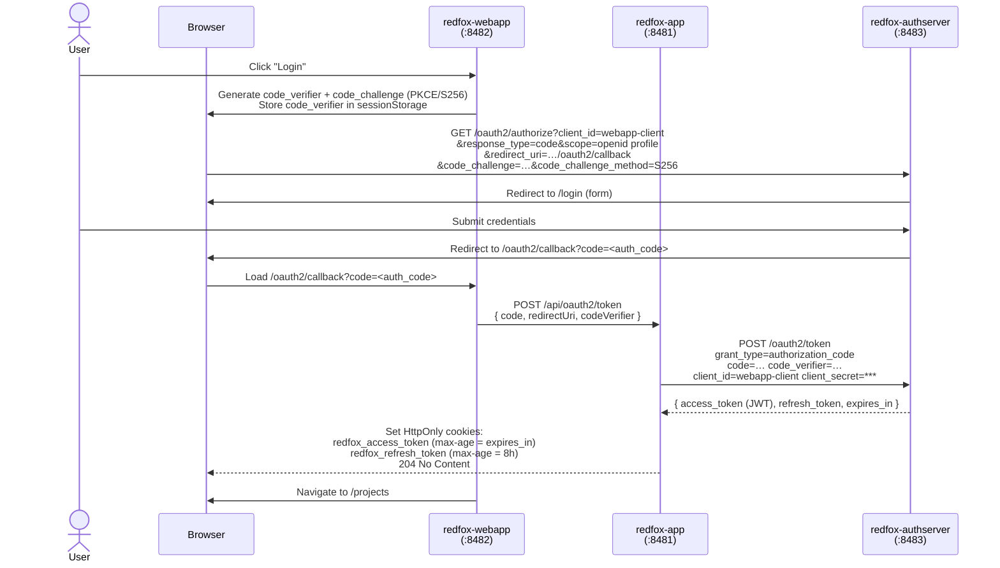

# RedFox Project

> **Proof of Concept** - demonstrates OAuth2 PKCE authentication across a three-tier Spring Boot + Angular architecture.

## Applications

| Application           | Port | Description                                                                                                                                                                                                                                                                                     |
|-----------------------|------|-------------------------------------------------------------------------------------------------------------------------------------------------------------------------------------------------------------------------------------------------------------------------------------------------|
| **redfox-webapp**     | 8482 | Angular SPA. Entry point for the user. Initiates the OAuth2 PKCE flow, handles the authorization callback, and calls the resource API. Manages Projects, Things, and Users.                                                                                                                     |
| **redfox-app**        | 8481 | Spring Boot resource server. Exposes the REST API and acts as a backend-for-frontend (BFF) for token operations - it holds the client secret and proxies token exchange and refresh requests to the authserver, keeping credentials off the browser. Validates JWTs on every protected request. |
| **redfox-authserver** | 8483 | Spring Authorization Server (OAuth2/OIDC). Authenticates users via a login form, issues short-lived access tokens (2 min) and long-lived refresh tokens (30 days). Sessions and authorizations are persisted in PostgreSQL.                                                                     |

## Authentication Flow

The webapp uses the OAuth2 Authorization Code flow with PKCE. The browser never sees the `client_secret` - all token 
requests are proxied through `redfox-app`.

## Token Refresh Flow

Access tokens expire after 2 minutes. The Angular `authInterceptor` transparently refreshes them on a 401 response and
retries the failed request. The refresh token is rotated on every use (`reuse-refresh-tokens: false`).

## Basic Auth

HTTP Basic authentication is enabled in `redfox-app` for testing convenience - it allows direct API calls without 
running through the full OAuth2 flow. Configured via `redfox.auth.basic.enabled=true|false`.
